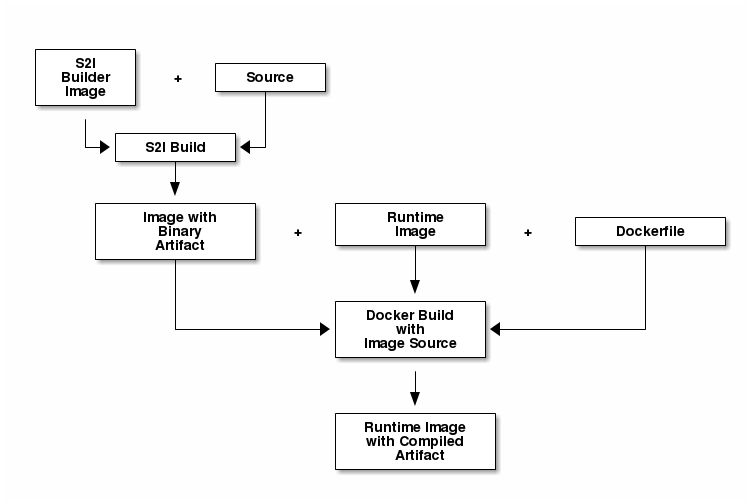

# Example Golang builder using a build chain

### Thanks to Jorge's examples in his blog: https://blog.openshift.com/chaining-builds/ 

Execute the example.sh script or manually execute the following commands to see how it works.



## Step-by-step, manual execution.

Create a new project (optional).

```
oc new-project go-chained-example
```

Import this go builder image.  This command will set up an Image Stream which points to the builder image. 

```
oc import-image jorgemoralespou/s2i-go --confirm
```

Create the Build Configurtion with the name of "builder".  This consists of the go s2i builder image and references the git repo for the example go source code.

```
oc new-build s2i-go~https://github.com/sjbylo/ose-chained-builds \
   --context-dir=/go-chained-example/hello_world \
   --name=builder
```

Watch the 1st "builder" build logs.

```
oc logs -f bc/builder --follow
```

The generated go executable is located in /opt/app-root/src/go/src/main/main

Create a new Build Configuraiton which uses the just created builder image as input, copies the go executable over into a new runtime container. 
A Dockerfile is used to build the runtime image. 

```
oc new-build --name=runtime \
   --docker-image=openshift/base-centos7 \
   --source-image=builder \
   --source-image-path=/opt/app-root/src/go/src/main/main:. \
   --dockerfile=$'FROM openshift/base-centos7\nCOPY main /main\nEXPOSE 8080\nENTRYPOINT ["/main"]' \
   --strategy=docker
```

Watch the 2nd, "runtime" build logs.

```
oc logs -f bc/runtime --follow
```

Deploy and expose the app once built.

```
oc new-app runtime --name=my-application
oc expose svc/my-application
```

Print the endpoint URL and visit it in your browser. 

```
oc get route/my-application -o jsonpath='{.status.ingress[0].host}'
```

## Or just run the script

```
bash example.sh
```

## Demo

Run the following in 2 different windows to view both of the builds in the chain

```
while true; do clear; oc logs bc/builder -f; sleep 2; done
while true; do clear; oc logs bc/runtime -f; sleep 2; done
```

